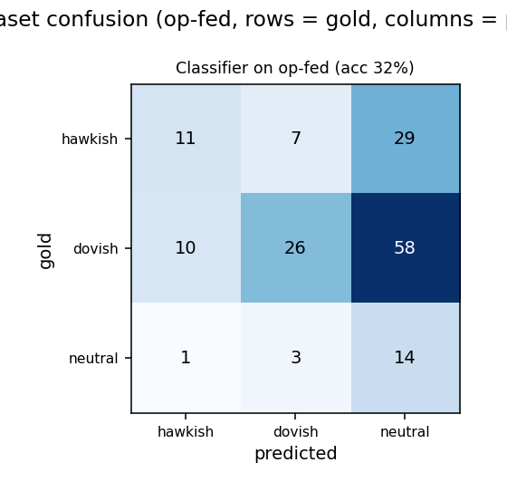

# Cross-dataset check: the tone classifier on op-fed

Generated by `scripts/eval_cross_dataset.py`. An out-of-distribution test of the supervised
classifier (ADR 0013), which is trained and tested on FOMC *speech* sentences ("Trillion Dollar
Words"). Here it is applied unchanged to **op-fed** (`kakeith/op-fed`, MIT; Keith et al.,
arXiv:2509.13539): 159 FOMC *meeting transcript* sentences with a usable stance label.

## Mapping

op-fed annotates stance against the hypothesis "We should tighten monetary policy", so the labels
map directly onto our classes: entailment -> hawkish, contradiction -> dovish, neutral -> neutral.
Rows whose stance is empty or `ambiguous` are dropped. Class distribution of the labeled subset:
hawkish 47, dovish 94, neutral 18.

This is a genuine distribution shift on two axes: the text is meeting-transcript discussion rather
than prepared speeches, and the labels come from a different annotation method (StanceNLI) than the
training benchmark. No model or threshold was refit on op-fed.

## Results

### Deterministic lexicon (zero-shot)

net-hawkishness with the neutral band tuned on the FOMC benchmark, applied unchanged.

- **Accuracy 20.1%** vs majority-class ("dovish") 59.1%
  (-39.0%).
- **Macro-F1 0.197**.

| class | precision | recall | F1 | support |
|---|---|---|---|---|
| hawkish | 0.55 | 0.13 | 0.21 | 47 |
| dovish | 0.89 | 0.09 | 0.16 | 94 |
| neutral | 0.13 | 1.00 | 0.23 | 18 |

Confusion matrix (rows = gold, columns = predicted):

| gold \ pred | hawkish | dovish | neutral |
|---|---|---|---|
| **hawkish** | 6 | 1 | 40 |
| **dovish** | 5 | 8 | 81 |
| **neutral** | 0 | 0 | 18 |

### Supervised classifier (zero-shot)

the FOMC-trained TF-IDF + logistic-regression model (ADR 0013), applied unchanged.

- **Accuracy 32.1%** vs majority-class ("dovish") 59.1%
  (-27.0%).
- **Macro-F1 0.318**.

| class | precision | recall | F1 | support |
|---|---|---|---|---|
| hawkish | 0.50 | 0.23 | 0.32 | 47 |
| dovish | 0.72 | 0.28 | 0.40 | 94 |
| neutral | 0.14 | 0.78 | 0.24 | 18 |

Confusion matrix (rows = gold, columns = predicted):

| gold \ pred | hawkish | dovish | neutral |
|---|---|---|---|
| **hawkish** | 11 | 7 | 29 |
| **dovish** | 10 | 26 | 58 |
| **neutral** | 1 | 3 | 14 |

## Honest reading

On op-fed the classifier scores **32.1% accuracy / macro-F1
0.318**, well below its in-distribution **59.9% / 0.582** on the FOMC speech
test split, and its accuracy is **below the dovish majority-class baseline (59.1%)** because the labeled subset is small (159
sentences) and skewed dovish. This is a hard transfer, and the result is reported as it is: meeting
transcript discussion under a StanceNLI annotation is a meaningfully different task from labeling
prepared-speech sentences, so much of the model's signal turns out to be specific to the speech
corpus it was trained on rather than general hawkish/dovish language. It still separates the classes
better than the lexicon on macro-F1 (0.318 vs 0.197), so it is
not merely guessing, but the drop is the honest headline. For genuinely out-of-corpus text the
production path is the Gemini judge, which does not rely on this model's learned vocabulary; a
fine-tuned transformer (survey next-step 4) would be the way to harden the offline scorer.
