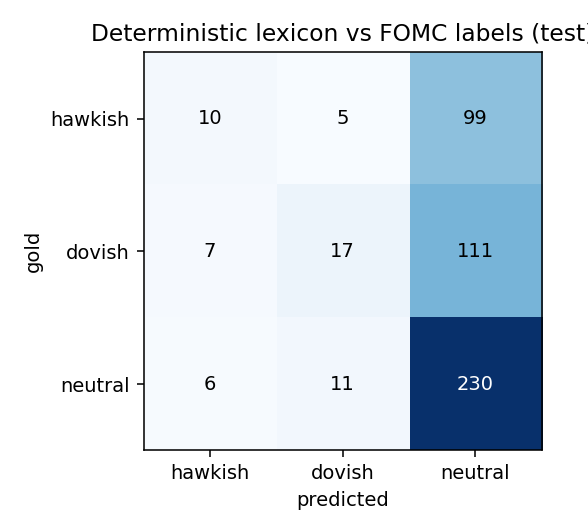
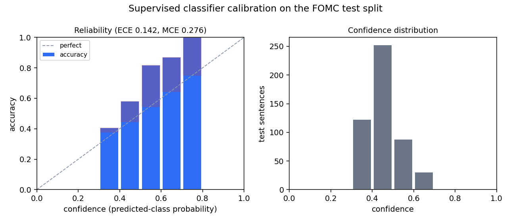

# Tone scorer evaluation

Generated by `scripts/eval_tone.py`. A real, reproducible evaluation against labeled data, not a
self-assessment. Re-run with `uv run python scripts/eval_tone.py` (no API key needed).

## Benchmark

"Trillion Dollar Words" (Shah, Paturi, Chava, ACL 2023), dataset `gtfintechlab/fomc_communication`
(CC BY-NC 4.0): FOMC sentences each labeled hawkish, dovish, or neutral. Used for offline
evaluation only; the corpus is not redistributed here (fetched into a gitignored cache). Split
sizes: train 1984, test 496. Label-mapping sanity check (train): mean lexicon score by gold label -> hawkish +0.039, neutral -0.013, dovish -0.171 (consistent with 0=dovish/1=hawkish/2=neutral).

## Method

Each scorer assigns one of hawkish / dovish / neutral to each sentence. Every hyperparameter (the
lexicon's neutral band, the classifier's regularization, vocabulary, and class balancing) was
chosen on train only (the classifier by k-fold cross-validation) and applied unchanged to the
held-out test split, which is scored exactly once. We report accuracy against the majority-class
baseline (so the lift is honest) and macro-F1 (which weights the three classes equally, not
dominated by the large neutral class).

## Results (held-out test split)

### Deterministic lexicon

net-hawkishness with negation handling; neutral band tau=0.0 tuned on train.

- **Accuracy: 51.8%** vs majority-class ("neutral") baseline
  49.8% (**+2.0%** over always-guess-majority).
- **Macro-F1: 0.339** (unweighted over the three classes).
- Fired on 60/496 (12.1%) of test sentences.

| class | precision | recall | F1 | support |
|---|---|---|---|---|
| hawkish | 0.43 | 0.09 | 0.15 | 114 |
| dovish | 0.52 | 0.13 | 0.20 | 135 |
| neutral | 0.52 | 0.93 | 0.67 | 247 |

Confusion matrix (rows = gold, columns = predicted):

| gold \ pred | hawkish | dovish | neutral |
|---|---|---|---|
| **hawkish** | 10 | 5 | 99 |
| **dovish** | 7 | 17 | 111 |
| **neutral** | 6 | 11 | 230 |

### Supervised classifier (TF-IDF + logistic regression)

class-balanced multinomial logistic regression over TF-IDF features, trained on the train split only (ADR 0013); predicts on every sentence.

- **Accuracy: 59.9%** vs majority-class ("neutral") baseline
  49.8% (**+10.1%** over always-guess-majority).
- **Macro-F1: 0.582** (unweighted over the three classes).
- Fired on 496/496 (100.0%) of test sentences.

| class | precision | recall | F1 | support |
|---|---|---|---|---|
| hawkish | 0.51 | 0.49 | 0.50 | 114 |
| dovish | 0.53 | 0.70 | 0.60 | 135 |
| neutral | 0.70 | 0.60 | 0.64 | 247 |

Confusion matrix (rows = gold, columns = predicted):

| gold \ pred | hawkish | dovish | neutral |
|---|---|---|---|
| **hawkish** | 56 | 26 | 32 |
| **dovish** | 11 | 94 | 30 |
| **neutral** | 43 | 57 | 147 |

## Is the classifier's gain over the lexicon real?

A paired comparison on the same 242 sentences the two scorers
disagree on. The classifier is right and the lexicon wrong on 141; the reverse on
101.

- **McNemar's test:** chi-square (continuity-corrected) 6.29, p = 0.0122
  (significant at 0.05).
- **Accuracy gain 8.1%**, bootstrap 95% CI
  [2.2%, 14.1%] (2000 resamples). The interval
  excludes zero.

## Are the classifier's confidences trustworthy?

Accuracy means little if a model is sure when it is wrong. Binning the supervised classifier's test
predictions by confidence (the predicted class's probability) measures whether a stated confidence
matches the observed hit-rate. For a three-class softmax the confidence cannot fall below 1/3, so
the low bins are empty by construction.

- **Expected calibration error (ECE): 0.142** (support-weighted mean absolute gap
  between confidence and accuracy; lower is better).
- **Maximum calibration error (MCE): 0.276** (worst populated bin).
- **Mean confidence minus accuracy: -0.142** (the direction of the
  miscalibration).
- **Brier score: 0.560** (mean squared error of the full predicted distribution).

| confidence bin | n | mean confidence | accuracy | gap (conf - acc) |
|---|---|---|---|---|
| 0.3-0.4 | 123 | 0.375 | 0.407 | -0.031 |
| 0.4-0.5 | 253 | 0.443 | 0.581 | -0.138 |
| 0.5-0.6 | 88 | 0.543 | 0.818 | -0.276 |
| 0.6-0.7 | 31 | 0.641 | 0.871 | -0.230 |
| 0.7-0.8 | 1 | 0.749 | 1.000 | -0.251 |

The gap is confidence minus accuracy, so a negative gap is under-confidence and a positive gap is
over-confidence. This model is under-confident: in every populated bin it is right more often than its probability claims, so its confidence is a conservative lower bound on its accuracy. This is common for a three-class softmax, which splits probability mass across the classes. The reliability diagram (left) plots accuracy against
confidence with the gap shaded; the histogram (right) shows how confidence is distributed.

## Honest reading

The supervised classifier (ADR 0013) is the strongest offline scorer: it learns from the whole
vocabulary, predicts on every sentence, and roughly doubles the lexicon's macro-F1, with the gain
over the lexicon significant under McNemar's test and a bootstrap confidence interval that excludes
zero. It is still a linear bag-of-words model on a hard three-class problem, so it is a credible
baseline, not a claim of state of the art (transformer models reported in the source paper score
higher). The lexicon remains the transparent, license-clean floor and the auditable cross-check on
the model; the classifier and the Gemini judge are the stronger signals layered on top.
The Gemini path is wired into this harness (`--with-gemini`, requires `CBT_GEMINI_API_KEY`); that run is pending an API key, after which its numbers join the table above for a three-way comparison.
